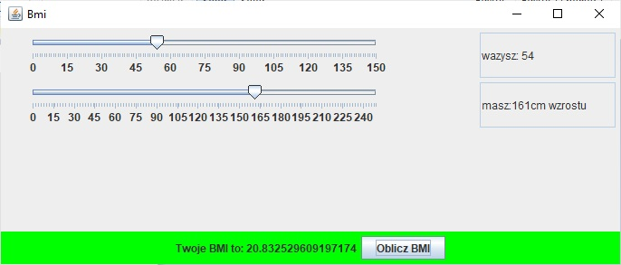
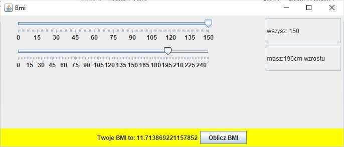

# BMICalculator
 
It is a simple calculator that allows you to calculate BMI from choosen values. Values can be selected from sliders or there is possibility to write them from keyboard. 

**Technologies:** Java, JavaFX, Sceen Bulder

**What have I learned new?**
  * Java basics
  * How to create windows application
  * How to create and handle buttons events
  * Using Sceen Builder

